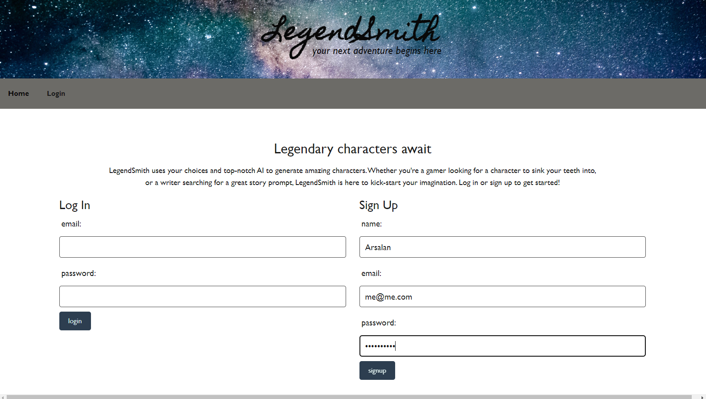
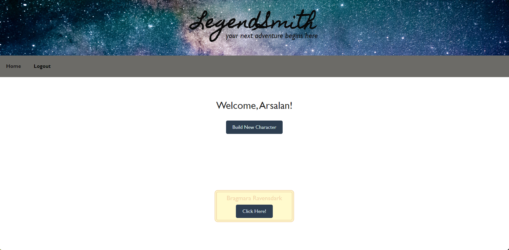

# <LegendSmith>

## Description

The motivation for this project was our love for RPG games and our nerdy backgrounds. Whether its for fun or if you need to create characters on the fly for your stories, this app is perfect. By providing a quick and convenient tool to generate diverse and intriguing characters, this app empowers users to overcome creative blocks and save time. We designed this app to offer a wide range of customizable race, backgrounds, and classes, ensuring that anyone can bring their envisioned characters to life with just a few taps. there were ups and downs throughout this whole project, one thing we learned quite quickly was to scarcely use our API resources as they diminish rapidly.

## Installation

No installation is required to access this web page! Please refer to the following deployment link to access the page: https://legendsmith-77384eb64fff.herokuapp.com/login

## Usage

In order to use the app you need to first sign up and make an account.
The following image shows how you can!

After signing up you will be redirected to a profile page where you can click the "Build New Character" button to start creating, and you will also see previous characters that were saved.

## Credits

List your collaborators, if any, with links to their GitHub profiles.

If you used any third-party assets that require attribution, list the creators with links to their primary web presence in this section.

If you followed tutorials, include links to those here as well.

## License

The last section of a high-quality README file is the license. This lets other developers know what they can and cannot do with your project. If you need help choosing a license, refer to [https://choosealicense.com/](https://choosealicense.com/).

---

The previous sections are the bare minimum, and your project will ultimately determine the content of this document. You might also want to consider adding the following sections.

## Badges

Badges aren't necessary, but they demonstrate street cred. Badges let other developers know that you know what you're doing. Check out the badges hosted by [shields.io](https://shields.io/). You may not understand what they all represent now, but you will in time.

## Features

If your project has a lot of features, list them here.

## How to Contribute

If you created an application or package and would like other developers to contribute to it, you can include guidelines for how to do so. The [Contributor Covenant](https://www.contributor-covenant.org/) is an industry standard, but you can always write your own if you'd prefer.

## Tests

Go the extra mile and write tests for your application. Then provide examples on how to run them here.
