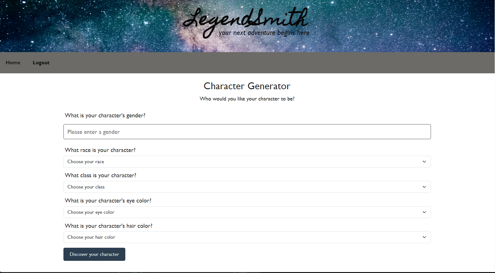
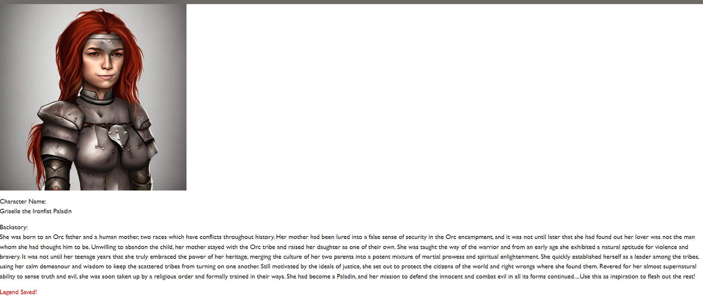

# <LegendSmith>

## Description

The motivation for this project was our love for RPG games and our nerdy backgrounds. Whether its for fun or if you need to create characters on the fly for your stories, this app is perfect. By providing a quick and convenient tool to generate diverse and intriguing characters with back stories, this app empowers users to overcome creative blocks and save time. We designed this app to offer a wide range of customizable race, backgrounds, and classes, ensuring that anyone can bring their envisioned characters to life with just a few taps. there were ups and downs throughout this whole project, one thing we learned quite quickly was to scarcely use our API resources as they diminish rapidly.

## Installation

No installation is required to access this web page! Please refer to the following deployment link to access the page: https://legendsmith-77384eb64fff.herokuapp.com/login

## Usage

In order to use the app you need to first sign up and make an account.
The following image shows how you can!

After signing up you will be redirected to a profile page where you can click the "Build New Character" button to start creating, and you will also see previous characters that were saved.

When you click the build new character button it will take you to the character form where you can personalize. You can give it a gender, race, class, eye color, and hair color. After all that you can click the Discover your character button to see the results!

Now its all you've been waiting for! the final reveal of your characters image and name and cool backstory.
After this you can either save the generated character or create another.

## Have fun messing around!

## Credits

Firstly our instructors Ben and Max helped us loads. We would especially like to thank them for their help with the image generator API and the login functionality.

We used files from Module 14 activities as the starter for our project and adapted them to achieve the functionality we desired.

The following sources were used to help understand the way we have to implement the APIs we needed.

Chat GPT API- https://www.youtube.com/watch?v=uRQH2CFvedY

Docs to help with the image API-

Leonardo- https://docs.leonardo.ai/reference/getuserself

The Next Leg- https://www.thenextleg.io/docs/v2/getting-started

Rapid API- https://rapidapi.com/piero.porro/api/ai-image-generator-from-a-prompt-using-openai-api/

Tips to not exhaust our API credits- https://www.elastic.io/integration-best-practices/api-rate-limiting-techniques-workarounds/#:~:text=It%20is%20possible%2C%20though%2C%20to,connection%20as%20an%20actual%20request

The following stack overflow query and answer gave insight so that we could capture user input from our character form: https://stackoverflow.com/questions/62341048/javascript-queryselector-for-select-element. This was used in our public > js > char-form.js file, lines 10-14.

Image we used for the header- https://unsplash.com/photos/E0AHdsENmDg

## License

MIT License
Copyright 2023 <COPYRIGHT HOLDER>

Permission is hereby granted, free of charge, to any person obtaining a copy of this software and associated documentation files (the "Software"), to deal in the Software without restriction, including without limitation the rights to use, copy, modify, merge, publish, distribute, sublicense, and/or sell copies of the Software, and to permit persons to whom the Software is furnished to do so, subject to the following conditions:

The above copyright notice and this permission notice shall be included in all copies or substantial portions of the Software.

THE SOFTWARE IS PROVIDED "AS IS", WITHOUT WARRANTY OF ANY KIND, EXPRESS OR IMPLIED, INCLUDING BUT NOT LIMITED TO THE WARRANTIES OF MERCHANTABILITY, FITNESS FOR A PARTICULAR PURPOSE AND NONINFRINGEMENT. IN NO EVENT SHALL THE AUTHORS OR COPYRIGHT HOLDERS BE LIABLE FOR ANY CLAIM, DAMAGES OR OTHER LIABILITY, WHETHER IN AN ACTION OF CONTRACT, TORT OR OTHERWISE, ARISING FROM, OUT OF OR IN CONNECTION WITH THE SOFTWARE OR THE USE OR OTHER DEALINGS IN THE SOFTWARE.
